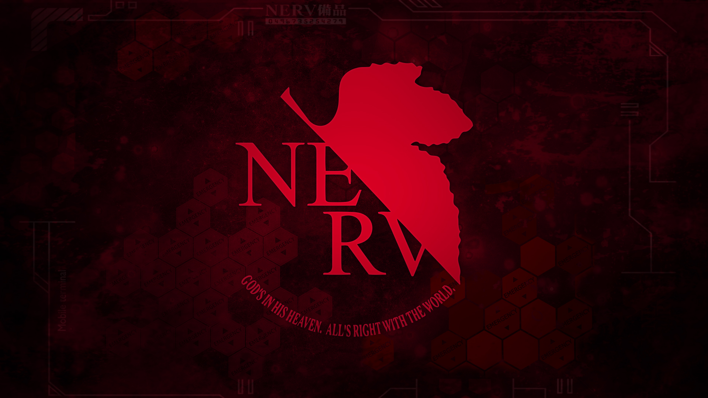

# NERV

> God's in his heaven. All's right with the world!
> — Pippa Passes

> Graduate's in his heaven. All's right with the code!
> — Ziyi Wu

Personal Python toolbox including project templates, useful functions, etc.

## Credit

Greatly inspired by and lots of code borrowed from:

- [cvbase](https://github.com/hellock/cvbase)
- [utils3d](https://github.com/Steve-Tod/utils3d)
- [PyTorch-Lightning](https://github.com/PyTorchLightning/pytorch-lightning)

\* Image credit: [Neon Genesis Evangelion](https://en.wikipedia.org/wiki/Neon_Genesis_Evangelion)

## Installation

First manually install PyTorch with cuda support (see `requirements.txt` for versions we tested), then run `pip install -e .` to install the whole package.
