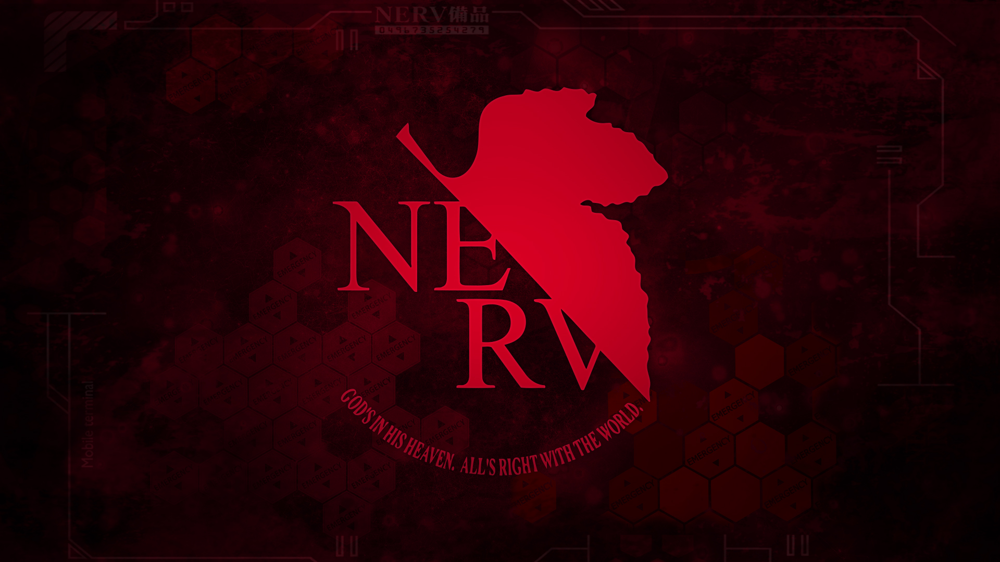

# NERV

<p align="center"></p>

> God's in his heaven. All's right with the world!
> — Pippa Passes

> Graduate's in his heaven. All's right with the code!
> — The dream of a struggling PhD student

Personal Python toolbox including project templates, useful functions, etc.
The training framework is tailored for the computing cluster at [Vector Institute](https://vectorinstitute.ai/), but can also be applied to other platforms.

## Credit

Greatly inspired by and lots of code borrowed from:

-   [cvbase](https://github.com/hellock/cvbase)
-   [utils3d](https://github.com/Steve-Tod/utils3d)
-   [PyTorch-Lightning](https://github.com/PyTorchLightning/pytorch-lightning)

\* Image credit: [Neon Genesis Evangelion](https://en.wikipedia.org/wiki/Neon_Genesis_Evangelion)

## Installation

-   Manually install PyTorch with cuda support (see `requirements.txt` for versions we tested)
-   Run `pip install -e .` to install the whole package

### Possible Issues

-   Our code automatically detect previous checkpoints according to the name of the config file.
    For example, if your config is `xxx_params.py`, we will save/load checkpoints under `checkpoint/xxx_params/models/`.
    Therefore, if you launch two runs with the same config file (even if their content are different), your new run might load the checkpoints from the old run.
    Instead, you should copy the config file to a new file, re-name it (potentially doing some modifications to test new settings), and thus avoid detecting old checkpoints.

    If you just want to run the same config file multiple times (e.g. 3 random seeds), you should use the [dup_run_sbatch.sh](./nerv/scripts/dup_run_sbatch.sh) script, which adds different suffix to differentiate the config files.

-   When you run the code with multi-GPU, we have implemented DDP in the Trainer.
    Please replace

    ```shell
    python xxx.py ...
    ```

    with

    ```shell
    python -m torch.distributed.launch --nproc_per_node=$NUM_GPU --master_port=29501 xxx.py ...
    ```

    to launch it.
    The deprecation warning can be ignored, which we plan to fix in the future.

-   If you run DDP with PyTorch>=2.0, you may encounter an error

    > error: unrecognized arguments: --local-rank=0

    This is likely due to an incompatibility between PyTorch 1.x and 2.x.
    You can fix it by modifying the `--local_rank` argument to `--local-rank` (e.g. [here](https://github.com/Wuziyi616/nerv/blob/4dca106f5b38ddeb98ea496582d490287dd89d7c/nerv/training/train.py#L91)).

-   When initializing the Trainer, we check the number of GPUs [here](https://github.com/Wuziyi616/nerv/blob/e83ac66c6ce30e1ca3d0a287df9d3699ed9ec499/nerv/training/method.py#L117).
    If you use `CUDA_VISIBLE_DEVICES=0,... python train.py xxx` to launch training in the commandline, then you will pass the check.
    But if you set `os.environ['CUDA_VISIBLE_DEVICES'] = '0,...'` in the python file (after importing `nerv`), this may trigger an error.
    We recommend to always use `CUDA_VISIBLE_DEVICES=0,...` to run python commands.

-   Some users have encountered a weird version issue with `opencv`.
    For `nerv>=0.1.0,<=v0.2.0`, `opencv-python==4.5.5.64`, `4.6.0.66`, and `4.7.0.72` are three tested versions.

## Related Projects

-   [SlotFormer](https://github.com/pairlab/SlotFormer) (ICLR'23)
